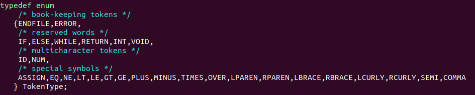
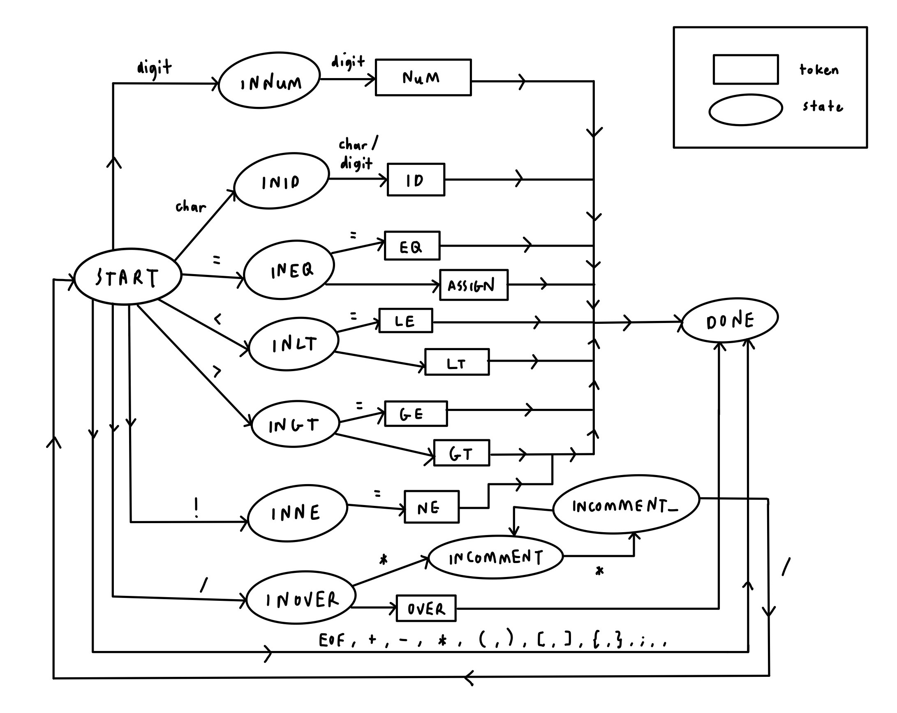
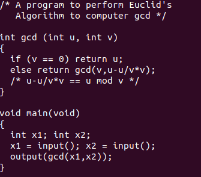
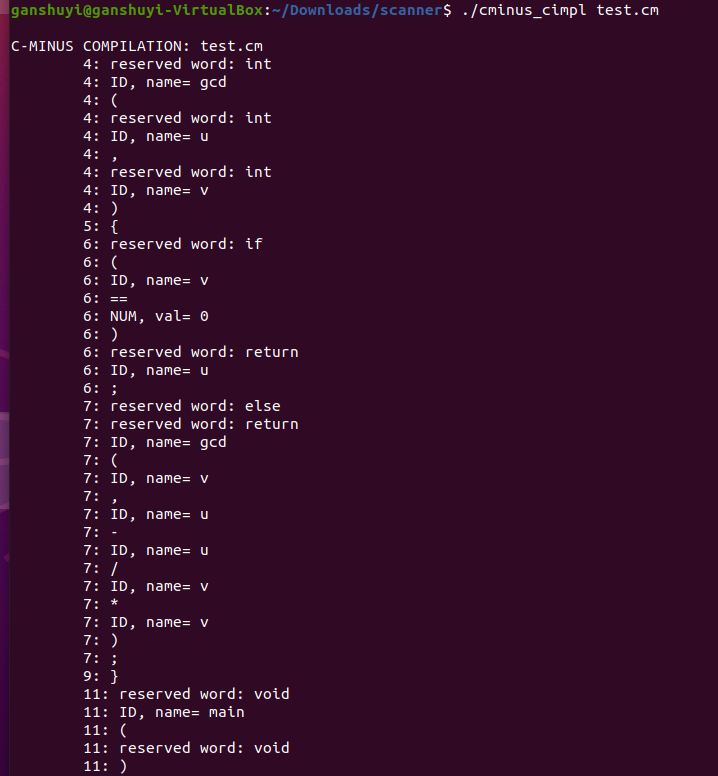
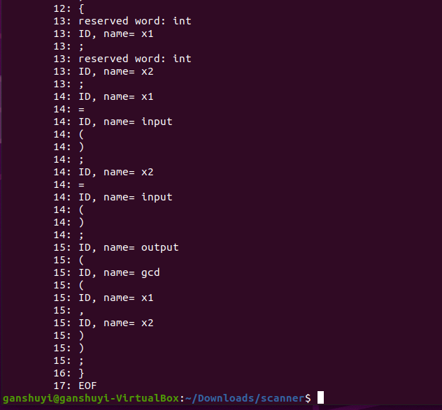
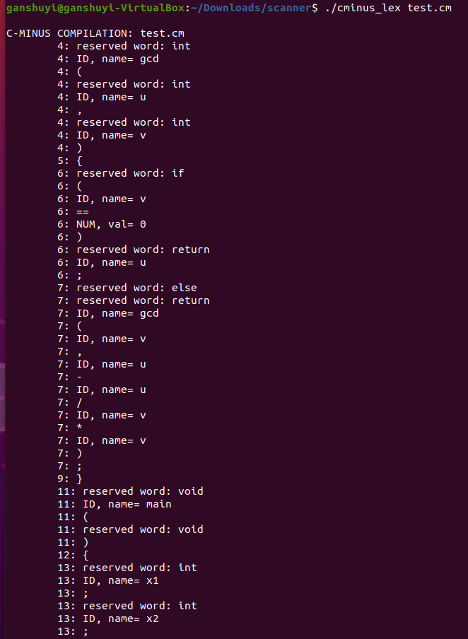
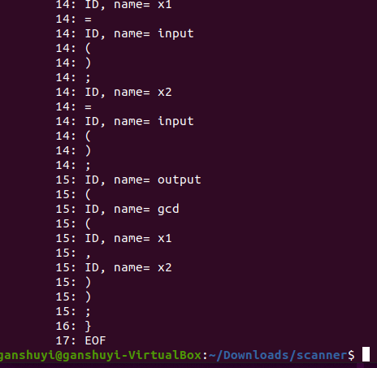

# **C-Minus Scanner Implementation**

### **Project Overview**

The goal of this project is to implement a C-Minus scanner. This scanner will be able to read an input source code string, tokenize it and outputs the recognized token. The scanner is implemented using **C code** and **Lex (flex)** in Linux Ubuntu 20.04 environment.

 

### **Compilation Method**

All codes are compiled with the following input at command prompt.

    make

To remove all files for recompilation, the following input can be entered at command prompt.

    make clean

To compile DFA and Lex implementation separately, the following lines can be entered at command prompt:

DFA implementation

    make cminus_cimpl

Lex implementation
    
    make cminus_lex

 

### **DFA Implementation in C**

In this project, a DFA is implemented in C to recognize tokens. The file **main.c** is modified by setting NO_PARSE and TraceScan to TRUE.

Next, the file **globals.h** is modified to accept tokens approved by C-Minus scanner. This is done by adding C-Minus tokens (i.e., reserved words, symbols) to TokenType.

The file **util.c** is then modified to output accepted tokens by DFA, which is done by modifying the function printToken(). In the switch statement, the cases for reserved words, identifiers, numbers, and symbols are added so they would print the output in their respective format. The function fprintf() is used for outputting the accepted tokens.

In the file scan.c, the lookup table of reserved words is modified by adding the reserved words accepted by the C-Minus scanner, as follows.

    IF, ELSE, WHILE, RETURN, INT, VOID

The following DFA states are added into the StateType data structure to support various possible states of the DFA.
    
    INEQ, INLT, INGT, INNE, INOVER, INCOMMENT, INCOMMENT_

Next, the getToken() function is modified so that it can operate as the DFA of the scanner. In the first case START, the symbols = (INEQ), < (INLT), > (INGT), ! (INNE), / (INOVER) and whitespace characters are added as else if cases so that the state can be changed accordingly. For example, the symbol = might be a ASSIGN symbol = or EQ symbol ==, thus the state is changed to INEQ so that the program can check the next character to see if another = sign is found to indicate it being EQ. In the else case of START, special symbols are added to indicate what token they symbolize (e.g., + symbolizes the PLUS token). The state is also changed to DONE.

The cases for different states are added after the break statement of the START case. In the state INID, since the identifier can be made up of letters and numbers, the isdigit() function is also added so that the DFA can accept digits that comes after characters as a part of an identifier’s name. For the states INEQ, INLT, INGT and INNE, if the next character that appears is =, then respective tokens are assigned to them, or else the ungetNextChar() function is used undo the reading of a character. In the state INOVER, if the next character to appear is \*, the state is changed to INCOMMENT, or else ungetNextChar() is used and the token will be accepted as an over symbol. In the INCOMMENT state, it will continue to ignore tokens until a ENDFILE or \* character appears. If * appears, the state is changed to INCOMMENT_ and the state will be changed to START again if / appears right afterwards. If not, the state will be changed back to INCOMMENT. The flag SAVE is set to false to not store the token for comment states, since any token that appears in the comment section /* */ are to be ignored.

The above diagram shows the changes in states in the getToken() function (token names EOF, PLUS, MINUS, TIMES, LPAREN, RPAREN, LBRACE, RBRACE, LCURLY, RCURLY, SEMI, COMMA are not represented in the diagram to reduce complexity).

 

### **Lex Implementation**

In this project, Lex program is created to specify lexical patterns by Regular Expressions. The files **globals.h**, **main.c**, **util.c** are the same of DFA implementation. The **scan.c** file is redundant since the getToken() function will be automatically generated using flex.

A new file **cminus.l** is created by modifying the **tiny.l** file provided. In the definition section, the identifier RE is changed as follows so that it can accept any combination of letter and digit as an identifier name, starting with a letter. The \* symbol indicates either none, one or more letter or digit.
    
    identifier      [a-zA-Z][A-Za-z0-9]*

Next, the rule section is modified so that it accepts C-Minus tokens. The reserved words and symbols are added with their respective TokenType names (e.g., “if” string will return IF TokenType). For the Lex program to ignore comments /* */, if the string “/\*” is encountered, an infinite while loop will be used to check next incoming inputs. If a EOF character is encountered, the loop will break. In the case of a newline character, the line number will be increased. If a * character is encountered and the next immediate character is /, the loop will break, indicating end of comment section.

 

### **DFA & Lex Implementation Sample Output**

This is a rundown how the DFA and Lex implementation programs are executed. The following test file **test.cm** is used as sample input file for both DFA and Lex implementations.

At command prompt, the following line is entered to execute the DFA implementation.

    ./cminus_cimpl test.cm

The following images shows the output of the execution.

To execute the Lex implementation program, the following line is entered at command prompt.

    ./cminus_lex test.cm

The following images shows the output of the execution.

The sample outputs show that the C-Minus scanner accepts the input file, reads each character, categorize the tokens as reserved word, identifier, comment or number, and outputs them accordingly. The line number is also incremented as the newline character is encountered.