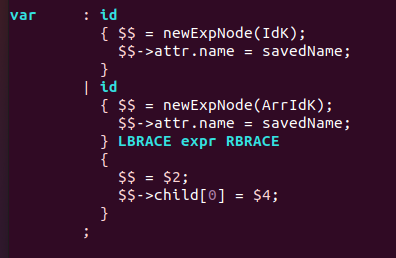

# **C-Minus Parser Implementation**

### **Project Overview**

The goal of this project is to implement a C-Minus parser using Yacc (bison). This parser will be able to read an input source code string of BNF grammar, tokenize it and parse it with C-Minus grammar and then return an **abstract syntax tree (AST)**. The scanner is implemented using **Lex** whereas the parser is implemented using **Yacc (bison)** in Linux Ubuntu 20.04 environment.

 

### **Compilation Method**

All codes are compiled with the following input at command prompt.

    make

To remove all files for recompilation, the following input can be entered at command prompt.
    
    make clean

The compiled code can be executed by inputting the following line at command prompt.

    ./cminus_parser test1.cm

 

### **Parser Implementation for C-Minus Language**

In this project, an LALR(1) parser is implemented as a syntax analyzer. The file **main.c** is modified by setting NO_ANALYZE and TraceParse flags to TRUE.

Next, the file **globals.h** of Yacc is modified to satisfy the specifications of C-Minus language. The structure of abstract syntax tree is defined as below. Each enumerated type handles different types of tree nodes.

The following image shows the struct declaration of the node of AST.

A structure arrayAttribute is also defined for handling attributes of an array.

In the file **util.c**, the function printTree() is modified to print a syntax tree that fits the criteria of this project. Each node is handled differently according to their node and tree type. For example, the node TypeK will output its tree type, INT or VOID based on the node’s type attribute. Also, the function printSpaces() is used to generate the correct spacing, based on indent number, when printing the AST.

New functions are also declared to generate each specific tree node type for syntax tree construction. The functions are newStmtNode(), newExpNode(), newDeclNode(), newParamNode(), and newTypeNode(), which serves to generate a new statement node, expression node, declaration node, parameter node, and type node respectively. In each function, the malloc function is used to generate tree node, before assigning the attributes of each node. The file **util.h** is also updated with the new function declarations.

The following image shows the function newStmtNode() which creates a new statement node.

Finally, the file **cminus.y** (initially **tiny.y**) is modified with the correct definitions and rules according to the given BNF grammar. In the definition section, the tokens are declared according to precedence and associativity. The precedence of the tokens is defined according to the BNF grammar: the deeper the tree node, the higher the precedence of each token. Non-associative tokens LOWERELSE and ELSE are also declared to solve shift/reduce conflict of *dangling else problem*. Priority is given to shift so that else is associated with the nearest if.

In the rules section, the grammar of C-minus and all reduce actions are defined. The C-minus grammar is defined according to BNF grammar as per given in project specifications. Reduce actions of the grammar is defined by creating a tree node according to its type. For example, variable is reduced into id or id [ expression ] depending on the next token, thus the function newExpNode() is called with parameter IdK or ArrIdK to create a new expression node. The name of identifier is also assigned to the node’s name attribute. For array variable, pointers to YYSTYPE object are used to assign their respective reduce action. The image below shows the parsing rules for variable.

In preparation for Project 3, the line number attributes are also assigned to each node during its creation. The function copyString() is used to pass the token name when assigning the name of tree node.

 

### **C-Minus Parser Sample Output**

This is a rundown of how the C-Minus parser implementation programs are executed. The following test file **test1.cm** is used as a sample input file for the parser.

At command prompt, the following line is entered to execute the C-Minus parser.

    ./cminus_parser test1.cm

The following image show the output syntax tree from parsing the input source file.

The sample output shows that the tokens (generated using C-minus scanner) are passed as input to the C-Minus parser, where it checks the syntax of the parsed input (syntax analysis) and then build a resulting abstract syntax tree (AST) as output.
