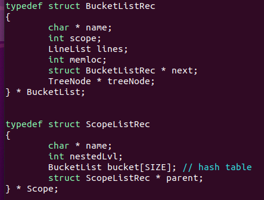
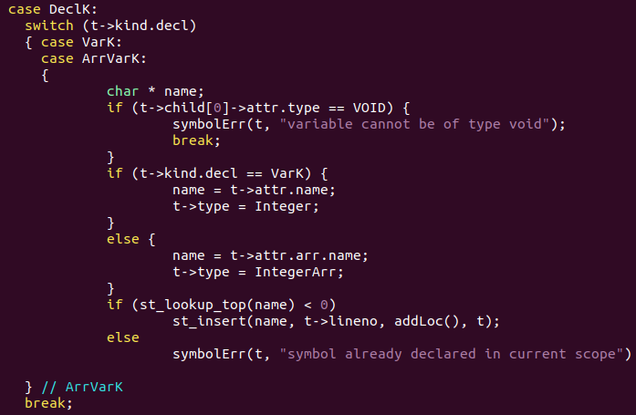
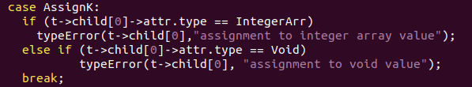

# **C-Minus Semantic Analyzer Implementation**

### **Project Overview**

The goal of this project is to implement a C-Minus semantic analyzer using **Symbol Table** and **Type Checker**. This semantic analyzer will be able to detect all semantic errors given an input source file. It reads an input source string and generates an Abstract Syntax Tree (AST), then traverse the AST to find and output all semantic errors. The analyzer is implemented (including **Lex** and **Yacc**) in Linux Ubuntu 20.04 environment.

### **Compilation Method**

All codes are compiled using GCC with the following input at command prompt.

    make

To remove all files for recompilation, the following input can be entered at command prompt.
    
    make clean

The compiled code can be executed by inputting the following line at command prompt.

    ./cminus_semantic test1.cm

 

### **Semantic Analyzer Implementation for C-Minus Language**

In this project, a symbol table and type checker are implemented. The file main.c is modified by setting NO_ANALYZE and TraceParse flags to FALSE, and TraceAnalyze flag to TRUE.

Next, the file **symtab.c** and **symtab.h** are modified to satisfy the static semantics of C-Minus language. The symbol table implements 3 basic operations: **insert**, **search**, and **delete**. A hash table is an entry array called a bucket. The hash function converts the index key (identifier name) into a hash value of an integer within the index range, and the items corresponding to the identifier will be stored in the bucket of the index. A scope list structure is used to keep track of all variables in a certain function scope.

The structures required to implement the symbol table are shown as follows.

Then, the files **analyze.c** and **analyze.h** are modified to implement symbol table generation and type checker.

For symbol table generation, the function buildSymTab traverses the AST generated by the parser to construct a symbol table. It uses the function traverse() for pre-order tree traversal. The insertNode() function determines when to insert an identifier alone with its respective attributes into the symbol table based on the TreeNode type. This function checks if the identifier is already defined in the table using the function st_lookup(), and if not, it calls the function st_insert() along with the attribute name, line number and location passed as parameters to create a new entry in the symbol table. If a duplicate declaration or an undeclared variable/function exists, it will raise a semantic error. The following shows the sample case.

After the symbol table is successfully built, the function printSymTab() is called to output the symbol table. The function is modified to print the attributes of each variable/function.

For type checker, the function typeCheck() modified so that it catches all the semantic errors of a C-Minus language. It uses the function traverse() to complete post-order traversal of the generated AST. The function checkNode() performs type checking based on the TreeNode type. For example, for a statement node, variables must be assigned to their respective types. If an integer is set to integer array value, then a type error will be raised.

Each node on the AST is checked and evaluated based on its respective node types: expression node, statement node, and so on.

Error messages are implemented using the function typeError(). It is used to output the line number and error type that is found during semantic analysis of the input code.